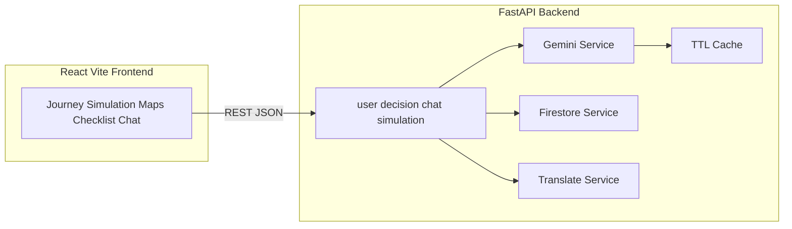

# VoteWise AI – Intelligent Election Companion

## 1. Problem Statement

Voting in India involves registration, roll verification, polling-booth logistics, and understanding EVM/VVPAT procedures. First-time voters, NRIs, and people who have moved cities often face fragmented information and anxiety on polling day. A plain chatbot dumps facts without structure; users need **guided flow**, **personalized rules**, and **safe practice** before they vote.

## 2. Solution Overview

VoteWise AI is a **full-stack guided election learning assistant**:

- A **step-by-step journey** (registration → verification → booth → preparation → casting vote) with progress and ELI5 explanations.
- A **decision intelligence** layer (rules for age, NRI, moved city) combined with **Gemini** for natural explanations.
- An **interactive simulation** of polling-day choices with dynamic feedback.
- **Readiness** tools: horizontal **timeline**, **checklist**, and **Google Maps** geocoding for locality context (with a clear reminder to confirm the official booth on ECI channels).
- **Multilingual** assistant flow via **Google Translate** (input → English for the model → output back) when `TRANSLATE_API_KEY` is set.

## 3. Key Innovations

| Innovation | What it does |
|------------|----------------|
| **Guided Journey Engine** | Five-step flow with progress bar, next/back, and “Explain simply” calling the chat API with ELI5 mode. |
| **Simulation Mode** | Scenario graph (`polling_day`) with branching feedback and score; not free-form chat. |
| **Decision Intelligence** | Deterministic rules (`age < 18`, NRI, moved city) merged with AI explanations in profile + chat. |
| **Premium UI** | React + Tailwind + shadcn-style primitives + **framer-motion**; full-screen **PulseBeams** hero and CTA **Start Your Voting Journey**. |

## 4. Architecture



- **Frontend** calls relative URLs in development (Vite proxy → `localhost:8000`). Production sets `VITE_API_BASE` to the API origin.
- **Backend** isolates integrations in `services/`; routes stay thin; Pydantic models in `models/schemas.py`.
- **Security**: API keys only in environment variables; user message **sanitization**; CORS configurable via `CORS_ORIGINS`.

## 5. Tech Stack

| Layer | Stack |
|--------|--------|
| Frontend | React 18, Vite 6, TypeScript, Tailwind CSS, Radix/shadcn-style UI, framer-motion, react-router-dom, @react-google-maps/api |
| Backend | FastAPI, Uvicorn, Pydantic v2, google-generativeai, firebase-admin, google-cloud-translate |
| Data / APIs | Firestore (optional), Gemini, Google Translate, Maps JavaScript API (frontend key) |

## 6. Setup Instructions

### Prerequisites

- Python **3.11+** (3.12 recommended)
- Node.js **20+** and npm

### Environment variables

Copy `.env.example` patterns into:

- **`backend/.env`** — `GEMINI_API_KEY`, optional `FIREBASE_CONFIG` or `GOOGLE_APPLICATION_CREDENTIALS`, `TRANSLATE_API_KEY`, `CORS_ORIGINS`.
- **`frontend/.env`** — `VITE_GOOGLE_MAPS_API_KEY` (Maps JavaScript API). Optionally `VITE_API_BASE` for production (e.g. `https://your-api.run.app`).

Example backend `.env`:

```env
GEMINI_API_KEY=your_key
FIREBASE_CONFIG={"type":"service_account",...}
TRANSLATE_API_KEY=your_translate_key
```

`FIREBASE_CONFIG` can be the full service account JSON as a **single-line** string.

### Backend

```bash
cd backend
pip install -r requirements.txt
# optional: create backend/.env with keys
uvicorn main:app --reload
```

API runs at `http://127.0.0.1:8000`. Open `http://127.0.0.1:8000/docs` for Swagger.

### Frontend

```bash
cd frontend
npm install
# optional: create frontend/.env
npm run dev
```

App runs at `http://localhost:5173` with API requests proxied to port **8000**.

### Tests (backend)

```bash
cd backend
pytest
```

Includes **decision logic unit tests** and an **API health/timeline** test.

### Cloud Run (backend)

A sample `backend/Dockerfile` runs Uvicorn on port **8080**. Deploy with your secrets as environment variables and set `CORS_ORIGINS` to your frontend origin.

## 7. Demo Flow

1. Open the **landing** page — full-screen **PulseBeams** hero → **Start Your Voting Journey**.
2. **Profile** — enter age, first-time voter, NRI, language, moved city → **Save** (Firestore when configured; otherwise local fallback) → view **decision rules**.
3. **Journey** — advance steps; use **Explain simply** for ELI5 (Gemini + optional translate).
4. **Simulation** — walk through polling-day choices; read dynamic feedback.
5. **Readiness** — timeline + **Am I ready to vote?** checklist.
6. **Booth Map** — search address; marker on map (verify booth officially on ECI).
7. **Assistant** — ELI5 toggle; chat uses profile context and **cached** repeated queries.

---

**Disclaimer:** VoteWise AI provides **educational** information only. Always confirm dates, forms, and polling-station details on the **Election Commission of India** and your state CEO portals.
